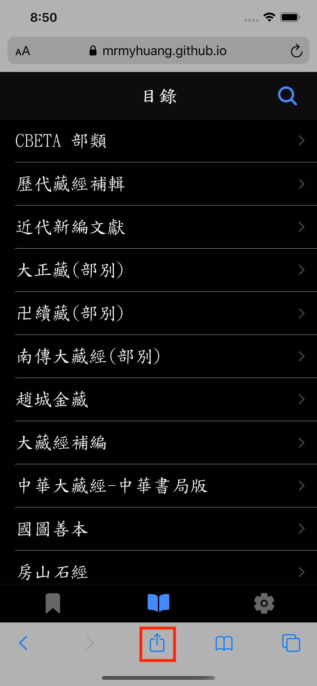
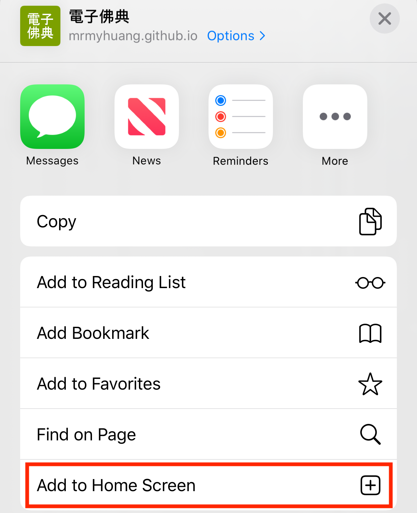
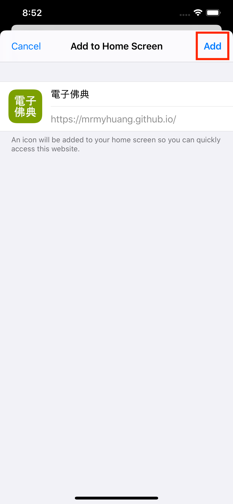
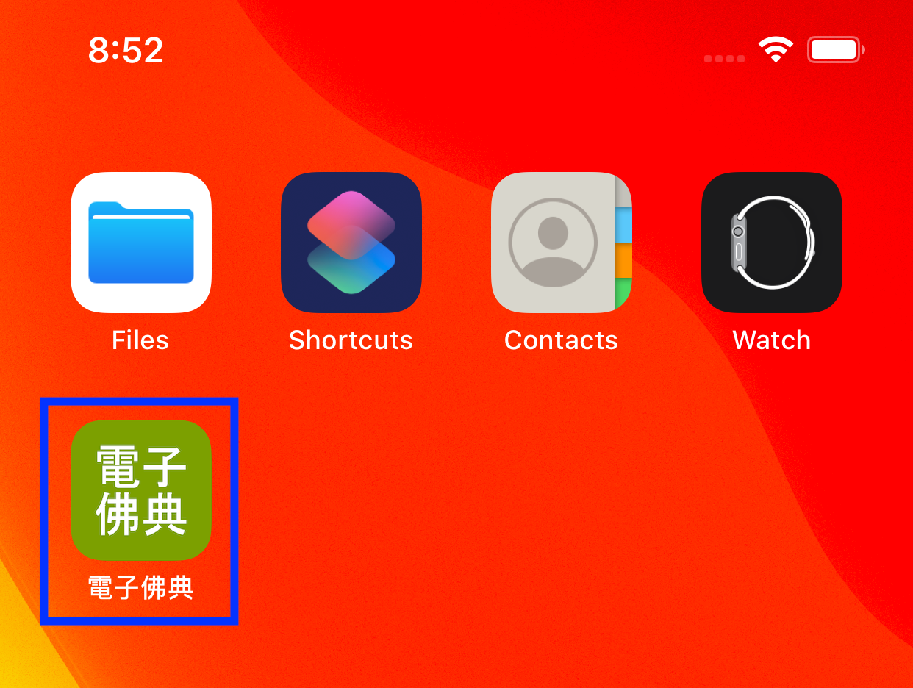

# CBETA電子佛典閱讀器2(非官方)

## 特色

搜尋經文、書籤功能、離線瀏覽、經文分頁、暗色模式、字型調整、直式文字、app更新。

## 介紹

CBETA電子佛典閱讀器2(非官方)，使用CBETA API存取電子佛經，支援以下功能

* 搜尋
    1. 在目錄頁，按下右上角放大鏡圖示。在對話框輸入經文部分標題，確認後會列出相關經文。
    
* 書籤
    1. 開啟某經文後，(手機、平板)長按後選擇想標記為書籤的字串位置，再按右上角書籤圖示，即新增一書籤，可至書籤頁查詢。
    2. 刪除：至書籤頁，左滑項目即出現刪除鈕，再點擊。
* 離線瀏覽
    1. 書籤頁包含的經文都具有離線瀏覽的功能。
* 經文分頁
    1. 經文可調整成單頁或分頁模式。單頁模式，使用滑動方式閱讀經文。分頁模式，可使用鍵盤方向鍵或螢幕方向鍵切換經文頁。
* 字型調整
    1. 考量視力不佳的同修，提供最大64px的經文字型設定。若有需要更大字型，請E-mail或GitHub聯絡開發者新增。
    2. 支援全字庫楷書字型。
* 直式文字
    1. 傳統中文書的直式文字、由右至左排版。
* App更新

    此app不定期發佈更新，包含新功能或bug修正。注意!App檔案更新後，要關閉、重啟1次app才會載入新版程式。目前支援2種更新方式:

    1. App啟動: app啟動後，會自動檢查一次有無新版。
    2. 手動: 至設定頁，按更新按鈕。
    3. 若已知有新版app，但按手動更新卻一直沒反應(bug!)，請嘗試關閉、重啟app，就會更新。

程式碼為開放，可自由下載修改。

## 程式

使用Ionic開發的Web App (PWA)，請參考 https://ionicframework.com/ 作開發環境建置。已在這些環境作過安裝、測試:

* Windows 10 + Edge Chrome
* Android 9 + Chrome
* macOS 10.15 + Edge Chrome
* iPad 7 (模擬器) + Safari
* iPhone 8 (模擬器) + Safari
* Debian Linux 10 + Chrome

## Web App
### 網址
https://MrMYHuang.github.io

### 安裝
#### Chrome (Windows, macOS, Linux, Android)
請參考： 

https://support.google.com/chrome/answer/9658361?hl=zh-Hant&co=GENIE.Platform%3DDesktop

#### Safari (iOS)
1. 使用Safari開啟web app網址，再點擊下方中間的"分享"圖示：



2. 滑動頁面至下方，點選"加入主畫面"(Add to Home Screen)：



3. 點擊"新增"(Add)：



4. App安裝完，出現在主畫面的圖示：



## Run Locally
```
git clone https://github.com/MrMYHuang/cbetar2.git
cd cbetar2
npm run start
```

## 版本歷史
* 2.0.6:
    * 支援分頁。
    * 書籤改用ePub CFI。
    * 刪除書籤改成在書籤頁左滑，再點刪除。
* 1.6.0:
    * 支援經文捲軸。
* 1.5.10:
    * 使用全字庫字型作楷書支援。
* 1.5.1:
    * 支援直式文字與楷書。
* 1.2.26:
    * 修正app無法在Chrome安裝的問題。
* 1.2.20:
    * 支援app啟動與手動檢查更新。
* 1.0.0:
    * 第1版。

## 隱私政策聲明

此app無收集使用者個人資訊。

## 第三方軟體版權聲明

1. 全字庫字型

    此app使用的全字庫字型(2020-08-18版)由國家發展委員會提供。此開放資料依政府資料開放授權條款 (Open Government Data License) 進行公眾釋出，使用者於遵守本條款各項規定之前提下，得利用之。政府資料開放授權條款：https://data.gov.tw/license