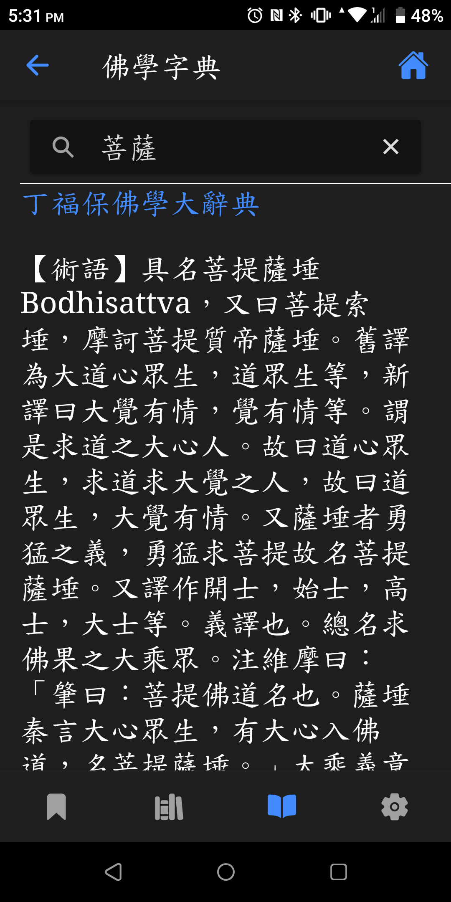
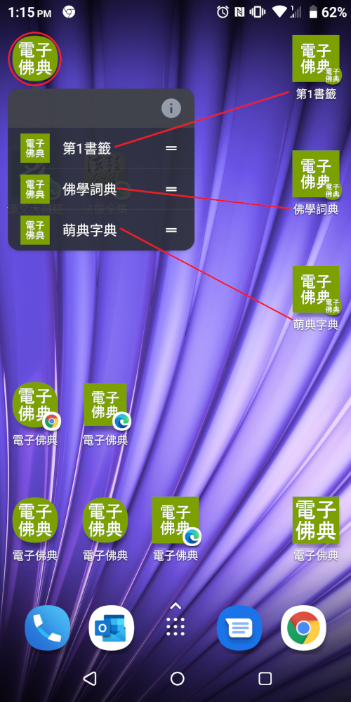

# CBETA電子佛典閱讀器2(非官方)

## <a id='feature'>特色</a>

搜尋目錄、全文檢索、書籤功能、網址分享、離線瀏覽、語音播放、佛學詞典、佈景主題切換、經文分頁、字型調整、楷書字型、直排文字、列印經文、app更新、跨平台、無廣告、開放原始碼。

## 說明

CBETA電子佛典閱讀器2(非官方)，使用CBETA API存取電子佛經，支援以下功能

* <a id='search'>搜尋</a>
  1. 搜索目錄：在目錄頁，按下右上角放大鏡圖示。在對話框輸入經文部分(或全部)標題，按下"搜索目錄"後會列出相關經文。
  
  2. 全文檢索：類似"搜索目錄"。但在對話框可輸入某卷經文內的一段文字，如"大水忽起卒至無期"。
* <a id='bookmark'>書籤</a>
  1. 開啟某經文後，(手機、平板)長按後選擇想標記為書籤的字串位置，再按右上角三點圖示，再選擇"新增書籤"，即新增一書籤，可至書籤頁查詢。
  2. 刪除：至書籤頁，左滑項目即出現刪除鈕，再點擊。
* <a id='shareAppLink'>網址分享</a>
  1. 用瀏覽器開啟此app並開啟某卷經文後，可複製其網址分享給別人開啟。
  2. 也可以使用瀏覽器內建書籤功能儲存經文網址。與app書籤功能相比，可以依個人使習慣作選擇。
  3. App內建"分享此頁"功能，可複製以下連結至作業系統剪貼簿或產生QR code，可分享給其他人：目錄、經、卷、目錄搜尋、全文檢索搜尋、詞典搜尋、app主頁
  4. 經文文字連結功能：選取經文一段文字後、執行"分享此頁"功能，所產生的app連結開啟後會自動跳至選取文字頁面並標示選取文字。
  5. 文章引用：選取經文一段文字後、執行"文章引用"功能，引用文字即複製至作業系統剪貼簿。引用格式基於CBETA Online，例如："《長阿含經》卷1：「長阿含經」(CBETA, T01, no. 1, p. 1a02)"
* 離線瀏覽
  1. 書籤頁包含的"經"或"卷"書籤都具有離線瀏覽的功能，並用圖示標示。
  2. 設定頁的"更新離線經文檔"按鈕用途為：當CBETA每季更新經文後，離線經文檔不會自動更新，必須手動執行此功能更新所有離線檔。
* <a id='text2speech'>語音播放</a>
  1. 使用電腦語音合成技術 - text to speech，作唸經文功能，即所謂的"有聲書"。(注意，當代電腦語音合成技術與"真人發音"仍有落差。因此聽到的經文發音偶爾不正確是正常現象。)
  2. 播放步驟：開啟經文 / 按下右上方播放鍵，即會從經文開頭播放（如擷圖所示）
  
  3. 指定位置播放：選取部分經文，按下播放鍵，即會從選取處開始播放。

* <a id='dictionary'>佛學詞典(線上查詢)</a>
  1. 整合"DILA 佛學術語字辭典"，可在"佛學詞典"分頁查詢佛學字詞。
  

  2. 也可以從查詢的結果選取文字，再執行查詢詞典功能。
  3. 也可以在經文頁選取文字後，執行查詢詞典功能。

* <a>萌典字典(線上查詢)</a>
  1. 整合"萌典"字典，可在"佛學詞典"分頁切換至"萌典字典"，可查詢單字，包括注音、解釋。
  2. 也可以從查詢的結果選取文字，再執行查詢字典功能。
  3. 也可以在經文頁選取文字後，執行查詢字典功能。

* 佈景主題切換
  1. 支援多種佈景主題。
  
  
  
  

* 經文分頁
  1. 經文可調整成單頁或分頁模式。單頁模式，使用滑動方式閱讀經文。分頁模式，可使用鍵盤方向鍵或螢幕方向鍵切換經文頁。
* 字型調整
  1. 考量視力不佳的同修，提供最大64px的經文字型設定。若有需要更大字型，請E-mail或GitHub聯絡開發者新增。
  2. 支援全字庫楷書字型。
* 直排文字
  1. 傳統中文書的直排文字、由右至左排版。
* <a id='shortcuts'>App捷徑</a>
  1. Windows, Android的Chrome(建議最新版)使用者，滑鼠右鍵或長按app圖示，可存取app功能捷徑，目前有：(開啟)第1書籤、佛學詞典、萌典字典。
  2. 不支援由Microsoft Store或Google Play Store下載的PWA!
  3. 若由舊版app升級至 >= 4.3.0版，要作一次移除app(但可不刪app資料)，再重新安裝，此app捷徑選單才會出現。

  

* <a id='print'>列印經文</a>
  1. 經文頁右上三點按鈕點開，按下列印按鈕，即會跳出列印對話框。
  2. 應用：可選擇印紙本或PDF檔。
  3. 調整：可至設定頁調整字型大小、橫/直排文字、黑體/楷書體，再作列印。
  4. 已在Chrome 87, Edge Chrome 87測過可用。Safari不支援!

* App設定匯出/匯入
  1. 此功能位於設定頁。
  2. 匯出app設定，同時也會匯出書籤資訊，可作備分。
  3. 匯入設定後，會重新下載離線經文檔。

* App更新

  此app不定期發佈更新，包含新功能或bug修正。注意!App檔案更新後，要關閉、重啟1次app或所有瀏覧器app分頁才會載入新版程式。目前支援2種更新方式:

  1. App啟動: app啟動後，會自動檢查一次有無新版。
  2. 手動: 至設定頁，按更新按鈕。

* <a id='report'>App異常回報</a>

  App設定頁的異常回報鈕使用方法為：執行會造成app異常的步驟後，再至設定頁按下異常回報鈕，即會自動產生一封E-mail，包含異常的記錄，發送此E-mail給我們即可。

程式碼為開放(MIT License)，可自由下載修改、重新發佈。

## 支援平台
已在這些環境作過安裝、測試:
* Windows 10 + Edge Chrome
* Android 9 + Chrome
* macOS 11 + Edge Chrome
* iPad 7 + Safari
* iPhone 8 (模擬器) + Safari
* Debian Linux 10 + Chrome

非上述環境仍可嘗試使用此app。若有<a href='#knownIssues'>已知問題</a>未描述的問題，可用<a href='#report'>異常回報</a>功能。

建議OS與Chrome、Safari保持在最新版，以取得最佳app體驗。

## Web App
此progressive web app (PWA)，可不安裝直接在網頁瀏覽器執行，或安裝至手機、平板、筆電、桌機。建議安裝，以避免瀏覽器定期清除快取，導致書籤資料不見！

### 網址
https://MrMYHuang.github.io

### 安裝

#### Windows, macOS, Linux, Android - Chrome
請參考Chrome官方文件： 

https://support.google.com/chrome/answer/9658361?hl=zh-Hant&co=GENIE.Platform%3DDesktop

#### Android
可從Google Play Store下載此PWA：

https://play.google.com/store/apps/details?id=io.github.mrmyhuang.cbetar2

(註：此種安裝渠道尚不支援"App捷徑"功能！)

#### Windows 10
可從Microsoft Store下載此PWA：

https://www.microsoft.com/store/apps/9P6TDQX46JJL

(註：此種安裝渠道尚不支援"App捷徑"功能！)

#### iOS - Safari
1. 使用Safari開啟web app網址，再點擊下方中間的"分享"圖示：


2. 滑動頁面至下方，點選"加入主畫面"(Add to Home Screen)：


3. 點擊"新增"(Add)：


4. App安裝完，出現在主畫面的圖示：


## 未來功能
1. 佛學詞典記錄歷史查詢。

## <a id='knownIssues'>已知問題</a>
1. iOS Safari在單頁模式下，捲軸無法顯示。
2. 目前多數Chrome無法暫停合成語音播放，因此此app目前經文語音播放功能不支援暫停，只支援停止。
3. 語音播放速度受限不同引擎、語音限制，可能無法達到指定速度。
4. "避免螢幕自動鎖定"功能僅限部分較新Chrome瀏覽器才支援。
5. iOS Safari 13.4以上才支援"分享此頁"功能。
6. iOS上，經文頁"搜尋文字"視窗中，按下搜尋鈕後，要再點擊一次向前搜尋鈕，被搜尋文字才開始會上色。
7. iOS不支援app捷徑。
8. Safari不支援列印經文。
9. iOS Safari選擇文字後，仍會閃爍彈出式選單才消失。

## <a id='history'>版本歷史</a>
* 4.8.2:
  * [改善] 經文頁選擇文字後，iOS Safari的彈出式選單容易遮到一些按鈕的問題。
  * [改善] 桌機環境無法開啟右鍵功能的問題。
* 4.8.0:
  * [改善] 經文頁選擇文字後，Android Chrome的彈出式選單容易遮到一些按鈕的問題。
  * [改善] Windows 10平板，在經文頁用觸控點擊方向鈕後，不會自動隱藏按鈕。
  * [新增] 經文頁、佛學詞典頁、萌典字典頁複製文字功能(取代Android Chrome, iOS Safari彈出式選單複製文字功能)。
* 4.7.1:
  * [改善] 滑動容易執行瀏覽器換頁，而非經文換頁的問題。
* 4.7.0:
  * [新增] 經文頁分頁模式支援觸控右/左(直排)、下/上(橫排)滑動換頁。
  * [修正] CBETA HTML .pre .lb的換行問題，如太虛大師年譜卷2的"絕對獨立之特德"該處的文字圖。
  * [改善] 經文頁支援 Ctrl + f 或 F3 鍵作搜尋文字功能。
  * [修正] 經文頁搜尋文字時選取的文字位置偏移的問題，如搜尋太虛大師年譜卷2的"絕對獨立之特德"。
* 4.6.7:
  * [修正] 第1次使用此app，無法開啟經文的問題。
  * [修正] 部/冊分類鈕位置。
  * [修正] 單頁橫排模式有時文字排版會出現兩欄的問題。
  * [修正] 經文頁內容補白隨視窗寬度增大的問題。
  * [修正] 經文列印字設為黑色、背景設定為白色。
  * [改善] app異常記錄。
* 4.6.1:
  * [修正] 經文頁"載入中..."過早消失的問題。
* 4.6.0:
  * [新增] 所有頁面讀取線上資料失敗會顯示刷新按鈕。
  * [修正] 經文單頁模式不顯示跳頁鈕。
  * [修正] 在內容區顯示目錄標題。
* 4.5.11:
  * [修正] 復原設定頁經文註腳、版權隱藏功能。
  * [修正] 若書籤資訊被刪除，但經文未正確刪除，會導致該經文無法再開啟的問題。
* 4.5.9:
  * [修正] 經文頁"引用文章"功能若選取文字結尾是標點符號，無法產生引用的問題。
  * [修正] 經文頁"引用文章"功能在部分經文，如法滅盡經，無法產生引用的問題。
* 4.5.6:
  * [改善] 設定頁經文字型大小調整預覽。
  * [改善] 設定頁字型最大值增至128。
  * [改善] 設定頁UI體驗。
  * [改善] 所有線上資料頁面皆加入"載入中..."提示。
  * [改善] 更多連結app功能與說明文件。
* 4.5.0:
  * [新增] 設定頁App設定匯出/匯入功能。
  * [改善] 列印經文調整留邊，以適合雙面列印。
* 4.4.5:
  * [修正] 佛學詞典與萌典字典選擇文字後，不能正確再執行查詞典或字典功能。
  * [改善] 書籤頁開啟排列功能後，無效點擊書籤會作提示。
* 4.4.3:
  * [修正] 下載楷書字型過早逾時的問題。
  * [修正] 桌機上調整視窗大小會出現錯誤對話框的問題。
  * [修正] 經文頁列印有時會造成一頁多欄排版的問題。
* 4.4.0:
  * [新增] 經文頁新增"列印"功能，詳見<a href='#print'>列印經文</a>。
* 4.3.0:
  * [新增] App捷徑，詳見<a href='#shortcuts'>說明</a>。
  * [新增] 調整書籤頁項目順序功能。
  * [新增] 經文頁新增"回經目錄"功能。
  * [修正] 將經目錄標題移至內容區，以方便顯示長標題。
* 4.1.8:
  * [修正] 實體方向鍵異常的問題。
  * [修正] 經文頁，彈跳選單項目順序。
  * [移除] 經文頁彈跳選單中的"跳頁(%)"功能。
* 4.1.7:
  * [修正] 經文頁單頁模式，"搜尋文字"功能異常問題。
* 4.1.6:
  * [修正] 經文若有全形空白，"搜尋文字"功能會找錯文字的問題。
  * [修正] 經文頁作"搜尋文字"後，切至其它頁面，下方搜尋狀態列仍顯示的問題。
  * [修正] Chrome Edge on Android，無法執行"搜尋文字"功能。
* 4.1.5:
  * [修正] 使用Chrome，文字輸入選擇自動完成字串後，文字與背景都是白色，有看不清楚的問題。
  * [修正] 使用iOS，跳出鍵盤後，版面縮小的問題。
  * [修正] 使用iOS作"搜尋文字"，不會顯示目前選取的搜尋文字。
* 4.1.4:
  * [修正] 設定頁"更新離線經文檔"執行後導致部分書籤無法開啟的問題。註：無法開啟的書籤請刪除再重新加入，造成不便請見諒。
* 4.1.3:
  * [增強] 全文搜索結果項目列出經書卷號，點擊後直接開啟該卷而不是該經目錄。
  * [修正] 使用Android，跳出鍵盤後，版面縮小的問題。此問題導致經文頁"搜尋文字"功能異常。
  * [修正] 經文頁頁碼鈕執行後，改為可鍵盤輸入式UI。
* 4.1.0:
  * [新增] 經文頁支援"搜尋文字"。
* 4.0.3:
  * [增強] 大量改善經文分頁模式跳頁效能。
* 4.0.2:
  * [修正] 經文頁讀取完楷書字體後，導致版面位移、書籤標記與總頁數異常的問題。
  * [修正] 經文頁底色在Chrome 87顯示不正確的問題。
* 4.0.1:
  * [增強] 搜尋頁面當連線失敗，會顯示訊息。
  * [增強] 記錄更多連線失敗的異常回報訊息。
* 4.0.0:
  * [修正] 使用IndexedDB解決離線儲存空間不足，無法新增書籤的問題。注意：舊版app升級後，請至設定頁執行1次"更新離線經文檔"！
* 3.11.0:
  * [新增] 經文頁支援"文章引用"。注意：舊版app升級後，請至設定頁執行1次"更新離線經文檔"！
  * [增強] 設定頁"更新離線經文檔"功能支援更新經的離線資訊。
  * [修正] 詞典/字典頁搜尋結果文字大小改為綁定"經文字型大小"設定。
  * [修正] 經文頁查詞典時，可能會複製到隱藏CBETA標記的問題。
  * [修正] 將經存為書籤後，無法開啟其中任何一卷經文的問題。
* 3.10.0:
  * 整合"萌典字典"，可至詞典頁切換至字典。
* 3.9.4:
  * "回報app異常記錄"功能加入更多診斷訊息。
* 3.9.3:
  * "回報app異常記錄"功能加入更多診斷訊息。
* 3.9.2:
  * [修正] 由書籤讀取經文後，此經文頁新增的書籤標題異常的問題。
  * [修正] 部分文章新增的書籤標題異常的問題。
* 3.9.0:
  * 設定頁新增"回報app異常記錄"按鈕。
* 3.8.5:
  * 佛學詞典頁可選擇已查詢文字，再執行查詞典功能。
  * 修正經文頁"查詞典"功能無法使用的問題。
* 3.8.4:
  * 使用IndexedDB達成iframe離線使用楷書字體。
* 3.8.3:
  * 修正分頁模式下，頁面隨頁數增加而跑掉版面的問題。
* 3.8.1:
  * 經目錄新支援"分品/分卷"切換按鈕。
* 3.7.2:
  * 修正"太虛大師年譜CBETA HTML檔經文表格樣式與縮排問題"。
  * 統一所有平台UI樣式。
* 3.7.0:
  * <a href='#text2speech'>"語音播放"</a>支援指定選取經文位置開始播放。
* 3.6.0:
  * 完成app連結支援跳至經文選取字功能，即開啟連結後，自動跳至選取文字頁面並標示選取字。
* 3.5.12:
  * 修正"app發佈更新後，字型檔會重新下載"的問題。
* 3.5.6:
  * 修正"app發佈更新後，舊app有時未正確顯示app更新提示訊息"。
* 3.5.2:
  * 修正"CBETA HTML檔經文內註解app未使用括號作區別的問題"。(感謝Godfery Wang指正)
* 3.5.1:
  * 修正經文單頁橫排模式，捲軸擋到經文的問題。
* 3.5.0:
  * 支援QR code分享app連結。
* 3.4.1:
  * 修改目錄頁按鈕順序。
* 3.4.0:
  * 目錄搜尋頁、全文檢索搜尋頁、詞典頁支援"分享此頁"功能。
* 3.3.7:
  * 修正第一次開啟此app且為下層連結，楷書字型無法正確載入的問題。
* 3.3.6:
  * 改善app效能。
* 3.3.5:
  * 修正目錄書籤標題。
* 3.3.4:
  * 修正點開書籤跳頁後，目前頁碼不正確的問題。
* 3.3.3:
  * 關閉經文內註腳連結，避免跳轉後與目前頁碼不同步。
* 3.3.2:
  * 修正直排模式，總頁數計算有誤。
* 3.3.0:
  * 支援全文檢索，見<a href='#search'>說明</a>。
  * 綁定部分文字大小至UI字型設定。
  * 調整部分圖示。
* 3.2.1:
  * 經文頁使用單選UI選擇跳頁頁碼。
* 3.2.0:
  * 支援分頁模式頁數顯示、跳至指定頁。
  * 修正點擊經文後，無法用鍵盤方向鍵跳頁。
* 3.1.1:
  * 修正多餘的API calls，改善目錄頁效能。
  * 修正新增的經文書籤標題。
* 3.1.0:
  * 支援"分享此頁"功能，請見<a href='#shareAppLink'>說明</a>。
* 3.0.0:
  * 修改/簡化app連結。(向下相容1.x.y, 2.x.y連結。)
  * 修正部分文章無法開啟。
* 2.9.0:
  * 支援佈景主題切換。
* 2.8.1:
  * 修正目錄頁"部/冊分類"切換鈕文字顏色。
* 2.8.0:
  * 修正目錄結構、使用CBETA Online相同冊分類順序。
* 2.7.1:
  * 調整UI改善使用體驗。
* 2.7.0:
  * 新增佛學詞典分頁，整合"DILA 佛學術語字辭典"。
* 2.6.0:
  * 設定頁新增"更新離線經文檔"按鈕。
* 2.5.0:
  * 解決在未載入此app的電腦，直接開啟此app的某卷經文連結，卻無法正確顯示的問題。
* 2.4.0:
  * 支援以"經"為單位存檔作離線瀏覽。
* 2.3.2:
  * 避免螢幕自動鎖定(Chrome)。
  * 語音播放速度支援至1.5倍。
* 2.3.1:
  * 修正macOS Safari經文語音播放異常問題。
* 2.3.0:
  * 支援經文語音播放功能。
  * 修正部分文字，綁定UI字型大小設定。
* 2.2.11:
  * 修復經文捲軸。
  * 修正單頁直排顯示，"載入中"提示未正確顯示。
* 2.2.10:
  * 修正經文第1次開啟後，加入的書籤被開啟後，無法正確還原書籤位置。
  * 使用黑體作另一種字體選擇。
* 2.2.9:
  * 修正部分對話框字型，綁定UI字型大小設定。
* 2.2.8:
  * 修正"標記(highlight)選取的書籤文字功能失效"。
* 2.2.7:
  * 修正"跳頁100%時，頁面卻切到開頭、不是結尾"。
  * 修正跳頁UI寬度。
* 2.2.6:
  * 修正分頁模式，上/下頁沒有反應問題。
  * 修正直排顯示時，經文上下補白隨視窗寬度增加的問題。
* 2.2.4:
  * 修正"直排、單頁模式，開啟經文卻顯示經文結尾處"。
* 2.2.3:
  * 對話框字型大小綁定UI字型大小設定。
  * 避開macOS Safari 14的bug。
* 2.2.1:
  * 使用iOS黑體解決直排楷書括號方向問題。
* 2.2.0:
  * 經文頁加入"載入中"提示。
  * 若連線CBETA API失敗，會顯示錯誤訊息。
  * 修正經文書籤無法離線瀏覽的問題。
  * 關閉經文中標記選取的書籤文字，以解決切至目錄頁後無法切回經文的問題。
* 2.1.0:
  * 修正書籤頁左滑刪除一書籤後，刪除鈕不會隱藏。
  * 經文頁新增書籤成功會有提示訊息。
  * 修正經文頁用鍵盤操作時會一次跳多頁。
  * Basic Latin字元改用Times New Roman字型。
* 2.0.6:
  * 支援分頁。
  * 書籤改用ePub CFI。
  * 刪除書籤改成在書籤頁左滑，再點刪除。
* 1.6.0:
  * 支援經文捲軸。
* 1.5.10:
  * 使用全字庫字型作楷書支援。
* 1.5.1:
  * 支援直排文字與楷書。
* 1.2.26:
  * 修正app無法在Chrome安裝的問題。
* 1.2.20:
  * 支援app啟動與手動檢查更新。
* 1.0.0:
  * 第1版。

## Run Locally
Please refer to https://ionicframework.com/ for building Ionic development environment.
```
git clone https://github.com/MrMYHuang/cbetar2.git
cd cbetar2
npm i
npm run start
```

## Build for Production
### Build on Windows
```
npm run build
```
### Build on macOS or Linux
```
npm run build_linux
```
Then, upload files under build folder to your github.io.

### Client Side Routing
Notice! This app uses client side routing for page navigation. Without loading this app (and its client side router) once, a client side route is resolved as a server side route by browser! Generally, the web server serving this app can't resolve this route and thus responses a 404 error. To solve this problem, this repo provides a 404.html for GitHub.io web server. When the GitHub.io server can't resolve a client side route, it redirects to 404.html, which further redirect to URL of this app with path info of the route. For example, if a user on a new PC opens this URL
https://mrmyhuang.github.io/bookmarks
, the GitHub.io server can't find bookmarks/index.html and thus redirects the resource to 404.html. Our 404.html extracts the app path "/bookmarks" and redirects the browser to the app URL https://mrmyhuang.github.io/ with query parameter `?route=/bookmarks`. After the app and its client side router loaded, the app redirects itself by using the original URL https://mrmyhuang.github.io/bookmarks by its router!

If a developer wants to migrate this app to other web servers, please use a similar server side redirection technique to correctly do the client side routing.

## 隱私政策聲明

此app無收集使用者個人資訊，也無收集匿名資訊。

## 第三方軟體版權聲明

1. <a href="http://cbdata.dila.edu.tw/v1.2/" target="_new">CBETA API參考文件</a>
2. <a href="http://glossaries.dila.edu.tw/?locale=zh-TW" target="_new">DILA 佛學術語字辭典</a>
3. 全字庫字型 ( https://data.gov.tw/dataset/5961 )

    此app使用的全字庫字型(2020-08-18版)由國家發展委員會提供。此開放資料依政府資料開放授權條款 (Open Government Data License) 進行公眾釋出，使用者於遵守本條款各項規定之前提下，得利用之。政府資料開放授權條款：https://data.gov.tw/license
4. <a href="https://github.com/g0v/moedict-webkit" target="_new">萌典字典</a>

## <a id='contributors'>App相關貢獻者 (依姓名英、中排序)</a>
* CBETA (https://cbeta.org)
* DILA (https://www.dila.edu.tw/)
* Godfery Wang
* Meng-Yuan Huang (myh@live.com)
