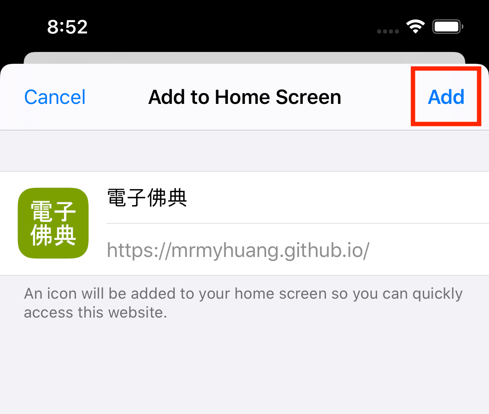

# CBETA電子佛典閱讀器2(非官方)

## <a id='feature'>特色</a>


搜尋目錄、全文檢索、書籤功能、網址分享、離線瀏覽、語音播放、佛學詞典、佈景主題切換、經文分頁、字型調整、楷書字型、直式文字、app更新、跨平台、無廣告、開放原始碼。

## 說明

CBETA電子佛典閱讀器2(非官方)，使用CBETA API存取電子佛經，支援以下功能

* <a id='search'>搜尋</a>
  1. 搜索目錄：在目錄頁，按下右上角放大鏡圖示。在對話框輸入經文部分(或全部)標題，按下"搜索目錄"後會列出相關經文。
  
  2. 全文檢索：類似"搜索目錄"。但在對話框可輸入某卷經文內的一段文字，如"大水忽起卒至無期"。
* <a id='bookmark'>書籤</a>
  1. 開啟某經文後，(手機、平板)長按後選擇想標記為書籤的字串位置，再按右上角三點圖示，再選擇"新增書籤"，即新增一書籤，可至書籤頁查詢。
  2. 刪除：至書籤頁，左滑項目即出現刪除鈕，再點擊。
* <a id='shareAppLink'>網址分享</a>
  1. 用瀏覽器開啟此app並開啟某卷經文後，可複製其網址分享給別人開啟。
  2. 也可以使用瀏覽器內建書籤功能儲存經文網址。與app書籤功能相比，可以依個人使習慣作選擇。
  3. App內建"分享此頁"功能，可複製目錄、經、卷的連結至作業系統剪貼簿，可分享給其他人。
* 離線瀏覽
  1. 書籤頁包含的"經"或"卷"書籤都具有離線瀏覽的功能，並用圖示標示。
  2. 設定頁的"更新離線經文檔"按鈕用途為：當CBETA每季更新經文後，離線經文檔不會自動更新，必須手動執行此功能更新所有離線檔。
* 語音播放
  1. 使用電腦語音合成技術 - text to speech，作唸經文功能，即所謂的"有聲書"。(注意，當代電腦語音合成技術與"真人發音"仍有落差。因此聽到的經文發音偶爾不正確是正常現象。)
  2. 播放步驟：開啟經文 / 按下右上方播放鍵（如擷圖所示）
  

* <a id='dictionary'>佛學詞典(線上查詢)</a>
  1. 整合"DILA 佛學術語字辭典"，可在"佛學詞典"分頁查詢佛學字詞。
  

  2. 整合"DILA 佛學術語字辭典"，可在"佛學詞典"分頁查詢佛學字詞。

* 佈景主題切換
  1. 支援多種佈景主題。
  
  
  
  

* 經文分頁
  1. 經文可調整成單頁或分頁模式。單頁模式，使用滑動方式閱讀經文。分頁模式，可使用鍵盤方向鍵或螢幕方向鍵切換經文頁。
* 字型調整
  1. 考量視力不佳的同修，提供最大64px的經文字型設定。若有需要更大字型，請E-mail或GitHub聯絡開發者新增。
  2. 支援全字庫楷書字型。
* 直式文字
  1. 傳統中文書的直式文字、由右至左排版。
* App更新

  此app不定期發佈更新，包含新功能或bug修正。注意!App檔案更新後，要關閉、重啟1次app才會載入新版程式。目前支援2種更新方式:

  1. App啟動: app啟動後，會自動檢查一次有無新版。
  2. 手動: 至設定頁，按更新按鈕。
  3. 若已知有新版app，但按手動更新卻一直沒反應(bug!)，請嘗試關閉、重啟app，就會更新。

程式碼為開放(MIT License)，可自由下載修改、重新發佈。

## 支援平台
已在這些環境作過安裝、測試:
* Windows 10 + Edge Chrome
* Android 9 + Chrome
* macOS 10.15 + Edge Chrome
* iPad 7 (模擬器) + Safari
* iPhone 8 (模擬器) + Safari
* Debian Linux 10 + Chrome

## Web App
此progressive web app (PWA)，可不安裝直接在網頁瀏覽器執行，或安裝至手機、平板、筆電、桌機。建議安裝，以避免瀏覽器定期清除快取，導致書籤資料不見！

### 網址
https://MrMYHuang.github.io

### 安裝
#### Windows, macOS, Linux, Android - Chrome
請參考Chrome官方文件： 

https://support.google.com/chrome/answer/9658361?hl=zh-Hant&co=GENIE.Platform%3DDesktop

#### iOS - Safari
1. 使用Safari開啟web app網址，再點擊下方中間的"分享"圖示：


2. 滑動頁面至下方，點選"加入主畫面"(Add to Home Screen)：


3. 點擊"新增"(Add)：



4. App安裝完，出現在主畫面的圖示：


## Run Locally
Please refer to https://ionicframework.com/ for building Ionic development environment.
```
git clone https://github.com/MrMYHuang/cbetar2.git
cd cbetar2
npm i
npm run start
```

## Build for Production
### Build on Windows
```
npm run build
```
### Build on macOS or Linux
```
npm run build_linux
```
Then, upload files under build folder to your github.io.

### Client Side Routing
Notice! This app uses client side routing for page navigation. Without loading this app (and its client side router) once, a client side route is resolved as a server side route by browser! Generally, the web server serving this app can't resolve this route and thus responses a 404 error. To solve this problem, this repo provides a 404.html for GitHub.io web server. When the GitHub.io server can't resolve a client side route, it redirects to 404.html, which further redirect to URL of this app with path info of the route. For example, if a user on a new PC opens this URL
https://mrmyhuang.github.io/bookmarks
, the GitHub.io server can't find bookmarks/index.html and thus redirects the resource to 404.html. Our 404.html extracts the app path "/bookmarks" and redirects the browser to the app URL https://mrmyhuang.github.io/ with query parameter `?route=/bookmarks`. After the app and its client side router loaded, the app redirects itself by using the original URL https://mrmyhuang.github.io/bookmarks by its router!

If a developer wants to migrate this app to other web servers, please use a similar server side redirection technique to correctly do the client side routing.

## 未來功能
1. 佛學詞典記錄歷史查詢。
2. App連結支援經文選取字書籤功能，即開啟連結後，自動跳至選取文字頁面並標示選取字。

## 已知問題
1. iOS Safari在單頁模式下，捲軸無法顯示。
2. 經文註腳、版權無法隱藏(因為會影響跳頁功能正確性)。
3. 目前多數Chrome無法暫停合成語音播放，因此此app目前經文語音播放功能不支援暫停，只支援停止。
4. 語音播放速度受限不同引擎、語音限制，可能無法達到指定速度。
5. "避免螢幕自動鎖定"功能僅限部分較新Chrome瀏覽器才支援。
6. iOS Safari 13.4以上才支援"分享此頁"功能。
7. 經文頁使用單選式UI選擇跳頁頁碼。因為如果使用鍵盤輸入式UI，在Android會發生鍵盤跳出後，經文頁面變小、頁數重新計算，導致難以跳至指定頁面。

## 版本歷史
* 3.3.5:
  * 修正目錄書籤標題。
* 3.3.4:
  * 修正點開書籤跳頁後，目前頁碼不正確的問題。
* 3.3.3:
  * 關閉經文內註腳連結，避免跳轉後與目前頁碼不同步。
* 3.3.2:
  * 修正直式模式，總頁數計算有誤。
* 3.3.0:
  * 支援全文檢索，見<a href='#search'>說明</a>。
  * 綁定部分文字大小至UI字型設定。
  * 調整部分圖示。
* 3.2.1:
  * 經文頁使用單選UI選擇跳頁頁碼。
* 3.2.0:
  * 支援分頁模式頁數顯示、跳至指定頁。
  * 修正點擊經文後，無法用鍵盤方向鍵跳頁。
* 3.1.1:
  * 修正多餘的API calls，改善目錄頁效能。
  * 修正新增的經文書籤標題。
* 3.1.0:
  * 支援"分享此頁"功能，請見<a href='#shareAppLink'>說明</a>。
* 3.0.0:
  * 修改/簡化app連結。(向下相容1.x.y, 2.x.y連結。)
  * 修正部分文章無法開啟。
* 2.9.0:
  * 支援佈景主題切換。
* 2.8.1:
  * 修正目錄頁"部/冊分類"切換鈕文字顏色。
* 2.8.0:
  * 修正目錄結構、使用CBETA Online相同冊分類順序。
* 2.7.1:
  * 調整UI改善使用體驗。
* 2.7.0:
  * 新增佛學詞典分頁，整合"DILA 佛學術語字辭典"。
* 2.6.0:
  * 設定頁新增"更新離線經文檔"按鈕。
* 2.5.0:
  * 解決在未載入此app的電腦，直接開啟此app的某卷經文連結，卻無法正確顯示的問題。
* 2.4.0:
  * 支援以"經"為單位存檔作離線瀏覽。
* 2.3.2:
  * 避免螢幕自動鎖定(Chrome)。
  * 語音播放速度支援至1.5倍。
* 2.3.1:
  * 修正macOS Safari經文語音播放異常問題。
* 2.3.0:
  * 支援經文語音播放功能。
  * 修正部分文字，綁定UI字型大小設定。
* 2.2.11:
  * 修復經文捲軸。
  * 修正單頁直式顯示，"載入中"提示未正確顯示。
* 2.2.10:
  * 修正經文第1次開啟後，加入的書籤被開啟後，無法正確還原書籤位置。
  * 使用黑體作另一種字體選擇。
* 2.2.9:
  * 修正部分對話框字型，綁定UI字型大小設定。
* 2.2.8:
  * 修正"標記(highlight)選取的書籤文字功能失效"。
* 2.2.7:
  * 修正"跳頁100%時，頁面卻切到開頭、不是結尾"。
  * 修正跳頁UI寬度。
* 2.2.6:
  * 修正分頁模式，上/下頁沒有反應問題。
  * 修正直式顯示時，經文上下補白隨視窗寬度增加的問題。
* 2.2.4:
  * 修正"直式、單頁模式，開啟經文卻顯示經文結尾處"。
* 2.2.3:
  * 對話框字型大小綁定UI字型大小設定。
  * 避開macOS Safari 14的bug。
* 2.2.1:
  * 使用iOS黑體解決直式楷書括號方向問題。
* 2.2.0:
  * 經文頁加入"載入中"提示。
  * 若連線CBETA API失敗，會顯示錯誤訊息。
  * 修正經文書籤無法離線瀏覽的問題。
  * 關閉經文中標記選取的書籤文字，以解決切至目錄頁後無法切回經文的問題。
* 2.1.0:
  * 修正書籤頁左滑刪除一書籤後，刪除鈕不會隱藏。
  * 經文頁新增書籤成功會有提示訊息。
  * 修正經文頁用鍵盤操作時會一次跳多頁。
  * Basic Latin字元改用Times New Roman字型。
* 2.0.6:
  * 支援分頁。
  * 書籤改用ePub CFI。
  * 刪除書籤改成在書籤頁左滑，再點刪除。
* 1.6.0:
  * 支援經文捲軸。
* 1.5.10:
  * 使用全字庫字型作楷書支援。
* 1.5.1:
  * 支援直式文字與楷書。
* 1.2.26:
  * 修正app無法在Chrome安裝的問題。
* 1.2.20:
  * 支援app啟動與手動檢查更新。
* 1.0.0:
  * 第1版。

## 隱私政策聲明

此app無收集使用者個人資訊，也無收集匿名資訊。

## 第三方軟體版權聲明

1. <a href="http://cbdata.dila.edu.tw/v1.2/" target="_new">CBETA API參考文件</a>
2. <a href="http://glossaries.dila.edu.tw/?locale=zh-TW" target="_new">DILA 佛學術語字辭典</a>
3. 全字庫字型 ( https://data.gov.tw/dataset/5961 )

    此app使用的全字庫字型(2020-08-18版)由國家發展委員會提供。此開放資料依政府資料開放授權條款 (Open Government Data License) 進行公眾釋出，使用者於遵守本條款各項規定之前提下，得利用之。政府資料開放授權條款：https://data.gov.tw/license